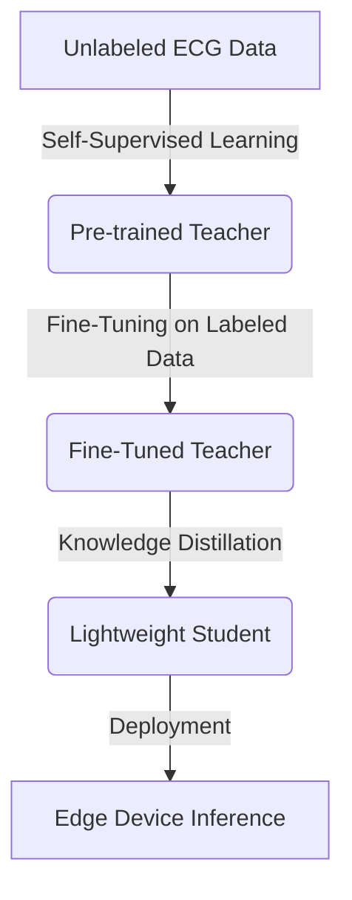

# ECG_SSL_KD

Welcome to the **ECG_SSL_KD** codebase! This repository implements a pipeline for Self-Supervised Learning (SSL) and Knowledge Distillation (KD) applied to Electrocardiogram (ECG) disease classification.

The primary goal of this project is to develop a highly accurate, lightweight ECG classification model that can be deployed on edge devices. We achieve this through a three-stage pipeline:

1. **Self-Supervised Pretraining (Teacher)**
2. **Supervised Fine-Tuning (Teacher)**
3. **Knowledge Distillation (Teacher $\rightarrow$ Student)**

---

## 🏗️ High-Level Architecture



### 1. Teacher Model
The teacher model is a high-capacity model designed to capture rich representations from ECG data. It features a dual-branch architecture tailored to the physical characteristics of ECGs:
- **Rhythm Branch:** Processes a long 10-second segment from Lead II to capture rhythm-level abnormalities.
- **Morphology Branch:** Processes shorter 2.5-second segments from the remaining 11 leads to capture beat-level morphological features.
- **Fusion Module:** Combines the outputs of both branches into a unified representation.

### 2. Student Model
The student model is a streamlined, lightweight network designed for fast and efficient inference on edge devices, maintaining high accuracy through knowledge distilled from the teacher.

---

## 📂 Directory Structure

Here is a breakdown of what each folder does:

### Core Modules
- **`models/`**: Defines the neural network architectures.
  - `teacher/`: Contains the `TeacherModel`, `RhythmEncoder`, `MorphologyEncoder`, and `FusionModule`.
  - `student/`: Contains the lightweight `StudentModel`.
- **`ssl/`**: Contains everything needed for Self-Supervised Learning.
  - Includes data augmentations (e.g., `GaussianNoise`, `RandomMask`, `LeadDropout`), projection heads, and contrastive loss functions like `NTXentLoss`.
- **`distillation/`**: Houses the Knowledge Distillation logic.
  - `distill_trainer.py`: Orchestrates the transfer of knowledge from teacher to student.
  - `kd_loss.py`, `feature_loss.py`: Loss functions that enforce alignment between teacher and student predictions/features.

### Data & Execution
- **`datasets/`**: Data loaders and processing scripts for standard ECG datasets like **PTB-XL** and **CINC2020**.
- **`training/`**: The core execution scripts for the three-stage pipeline.
  - `train_teacher_ssl.py`: Stage 1 (SSL Pretraining).
  - `train_teacher_supervised.py`: Stage 2 (Supervised Fine-Tuning).
  - `train_student_distillation.py`: Stage 3 (Knowledge Distillation).
  - `train_student.py`: For training a student from scratch as a baseline comparison.
- **`evaluation/`**: Scripts and metrics (e.g., F1, AUROC) to evaluate the performance of trained models.
- **`configs/`**: YAML configuration files controlling hyperparameters, paths, and training modes.
- **`utils/`**: Helper scripts for logging, checkpointing, and setting random seeds.

---

## 🚀 Getting Started

To run the pipeline, use the `main.py` orchestrator script, which relies on the YAML configs. 

### Stage 1: Train Teacher with SSL
```bash
python main.py --mode ssl --config configs/ssl.yaml
```

### Stage 2: Fine-Tune Teacher
```bash
python main.py --mode finetune --config configs/finetune.yaml
```

### Stage 3: Distill to Student
```bash
python main.py --mode distill --config configs/distill.yaml
```

---

## 💡 Notes for New Members

> [!TIP]
> **Understanding the Data Shape:** Pay attention to how the input tensors are shaped! The teacher model splits the standard 12-lead ECG into a **Lead II rhythm tensor `(1, 5000)`** and a **11-lead morphology tensor `(11, 1250)`**. This is a crucial design decision for deployment.

> [!NOTE]
> **Checkpoints:** Model weights during training are saved using `utils/checkpoint.py`. Make sure your paths in the `configs/` YAML files point to a valid directory for saving/loading.

Happy coding, and welcome to the team!
